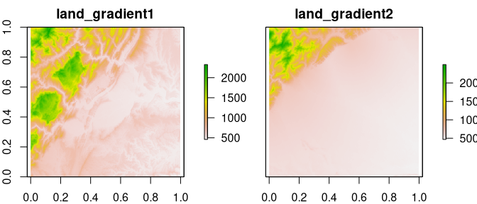

<!-- README.md is generated from README.Rmd. Please edit that file -->

# belg

<!-- badges: start -->

[](https://cran.r-project.org/package=belg)
[](https://github.com/r-spatialecology/belg/actions)
[](https://codecov.io/gh/r-spatialecology/belg)
[](https://cran.r-project.org/package=belg)
[](https://doi.org/10.5281/zenodo.1209419)
<!-- badges: end -->

Boltzmann entropy (also called configurational entropy) has been
recently adopted to analyze entropy of landscape gradients (Gao et
al. (2017, 2018, 2019)). The goal of **belg** is to provide an
efficient C++ implementation of this method in R. It also extend the
original idea by allowing calculations on data with missing values
(Nowosad and Gao (2020)).

## Installation

You can install the released version of belg from
[CRAN](https://CRAN.R-project.org) with:

``` r
install.packages("belg")
```

And the development version from [GitHub](https://github.com/) with:

``` r
# install.packages("remotes")
remotes::install_github("r-spatialecology/belg")
```

## Examples

As an example, we use two rasters - `land_gradient1` representing a
complex landscape and `land_gradient2` representing a simple landscape:

``` r
library(raster)
library(belg)
plot(stack(land_gradient1, land_gradient2))
```



The main function in this package, `get_boltzmann()`, calculates the
Boltzmann entropy of a landscape gradient:

``` r
get_boltzmann(land_gradient1)
#> [1] 188772.5
get_boltzmann(land_gradient2)
#> [1] 121875.2
```

This function accepts a `RasterLayer`, `RasterStack`, `RasterBrick`,
`matrix`, or `array` object as an input. It allows for calculation of
the relative (the `relative` argument equal to `TRUE`) and absolute
Boltzmann entropy of a landscape gradient. As a default, it uses a
logarithm of base 10 (`log10`), however `log` and `log2` are also
available options for the `base` argument.

``` r
get_boltzmann(land_gradient1, base = "log")
#> [1] 434664.7
get_boltzmann(land_gradient1, relative = TRUE)
#> [1] 137645.4
get_boltzmann(land_gradient1, base = "log2", relative = TRUE)
#> [1] 457248.1
```

Two methods of calculating the Boltzmann entropy of a landscape gradient
are available: `"hierarchy"` (default) for the hierarchy-based method
(Gao et al., 2017) or `"aggregation"` for the aggregation-based method
(Gao et al., 2019). The aggregation-based method requires that the
number of rows and columns in the input data must be a multiple of 2.

``` r
get_boltzmann(land_gradient1, method = "aggregation")
#> [1] 188772.5
get_boltzmann(land_gradient1, relative = TRUE, method = "aggregation")
#> [1] 137645.4
```

More examples can be find at <https://github.com/Nowosad/belg-examples>.

## References

  - Gao, Peichao, Hong Zhang, and Zhilin Li. “A hierarchy-based solution
    to calculate the configurational entropy of landscape gradients.”
    Landscape Ecology 32(6) (2017): 1133-1146.
  - Gao, Peichao, Hong Zhang, and Zhilin Li. “An efficient analytical
    method for computing the Boltzmann entropy of a landscape gradient.”
    Transactions in GIS (2018).
  - Gao, Peichao and Zhilin Li. “Aggregation-based method for computing
    absolute Boltzmann entropy of landscape gradient with full
    thermodynamic consistency.” Landscape Ecology (2019).
  - Nowosad, J.; Gao, P. belg: A Tool for Calculating Boltzmann Entropy
    of Landscape Gradients. Entropy 2020, 22, 937.
    <https://doi.org/10.3390/e22090937>
