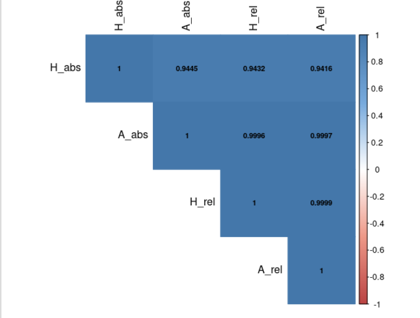

```{r setup, include = FALSE}
knitr::opts_chunk$set(
  collapse = TRUE,
  comment = "#>",
  echo = FALSE
)
```

Two main methods for calculating Boltzmann Entropy of a landscape gradient implemented in **belg**: (1) hierarchy-based and (2) aggregation-based. 
Both of these methods have two variants: relative (calculation are based only on one scale) and absolute (the result is based on calculations of many spatial scales). 
The first method was created in 2017 (Gao et al. 2017).
However, in 2019, it was discovered that the absolute hierarchy-based method is not consistent -- in other words, it can give wrong results for some corner cases (more about this can be found in Gao et al. 2019).
Therefore, a new approach (the aggregation-based method) was developed.
This new approach has a different limitation - it requires the number of rows and columns in the input data to be a multiple of 2.

Quick summary:

|method            |type     |consistent |limitations                              |
|:-----------------|:--------|:----------|:----------------------------------------|
|Hierarchy-based   |Relative |Yes        |                                         |
|Hierarchy-based   |Absolute |No         |                                         |
|Aggregation-based |Relative |Yes        |rows and columns must be a multiple of 2 |
|Aggregation-based |Absolute |Yes        |rows and columns must be a multiple of 2 |

I derived 619 different rasters (64 by 64 pixels) and calculated Boltzmann entropy using all four variants.
You can find the correlation matrix of the results below:

```{r, fig.width=6}

```

These results suggest that: 

- If you can - use the absolute aggregation-based method, 
- If you cannot (due to, e.g, raster dimensions), use the relative hierarchy-based method.

## References

- Gao, Peichao, Hong Zhang, and Zhilin Li. "An efficient analytical method for computing the Boltzmann entropy of a landscape gradient." Transactions in GIS (2018).
- Gao, Peichao, Hong Zhang, and Zhilin Li. "A hierarchy-based solution to calculate the configurational entropy of landscape gradients." Landscape Ecology 32(6) (2017): 1133-1146.
